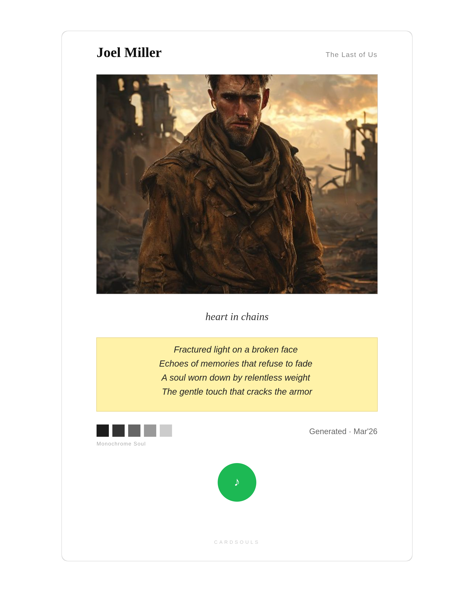
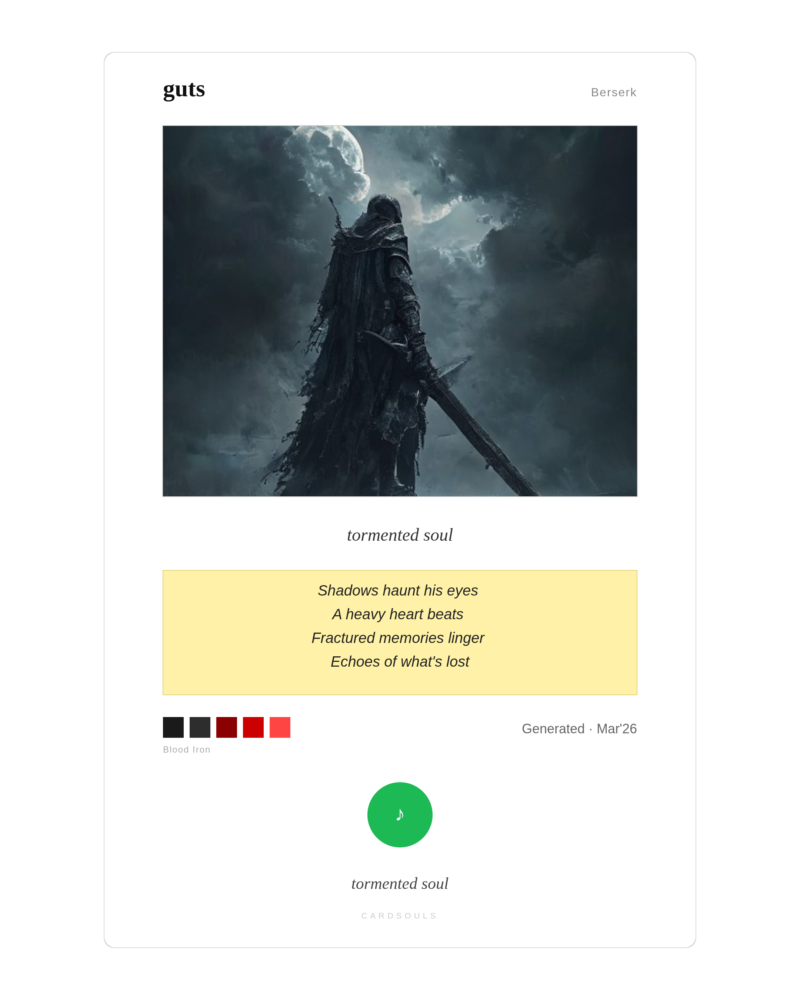

<div align="center">

# 🎴 CardSouls

### *Turn your emotional connection to a fictional character into an aesthetic collectible card.*

[](https://nextjs.org/)
[](https://groq.com/)
[](https://pollinations.ai/)
[](LICENSE)
[](https://vercel.com/new)

<br/>

> *"Every card should feel like: this is exactly how I see this character."*
> *Not fandom. Not wiki. A mirror of your internal emotional world, made visual.*

<br/>

---

</div>

## 🎬 Demo

https://github.com/user-attachments/assets/demo-video

> 👆 *If the video doesn't load above, see it here:* [`reference/Screencast from 2026-03-08 17-02-09.mp4`](reference/Screencast%20from%202026-03-08%2017-02-09.mp4)

<video src="reference/Screencast from 2026-03-08 17-02-09.mp4" width="100%" controls autoplay muted loop></video>

---

## 🎴 Generated Cards

<p align="center">
  
  &nbsp;&nbsp;&nbsp;
  
</p>

<p align="center"><i>Cards generated for <b>Guts</b> from <b>Berserk</b> — "Tormented Soul"</i></p>

---

## ✨ What It Does

You input:
- 🧑 **Character name** & source media
- 💭 **Your emotional resonance** — what the character means to *you*
- 🎨 **Aesthetic preference** — dark, ethereal, brutal, warm, cold...

CardSouls generates:
- 🖼️ **AI character portrait** tailored to the aesthetic
- ✍️ **Poetic verse** capturing your connection
- 🎵 **Matching soundtrack** from Deezer
- 🎨 **Curated color palette**
- 📥 **Downloadable PNG** with crisp 2x resolution

**All for free. Forever.**

---

## 🛠️ Tech Stack

<div align="center">

| Layer | Technology | Cost |
|:------|:-----------|:----:|
| ⚡ Framework | **Next.js 16** (App Router, TypeScript) | Free |
| 🎨 Styling | **Tailwind CSS** | Free |
| 🧠 LLM | **Groq** — Llama 3.3 70B Versatile | Free (14,400 RPD) |
| 🖼️ Image Gen | **Pollinations.ai** (Flux model) | Free (unlimited) |
| 🎵 Music | **Deezer API** | Free (no auth) |
| 📱 QR Codes | `qrcode` npm package | Free |
| 🔍 Linter | **Biome** | Free |
| 🚀 Deploy | **Vercel** | Free (Hobby) |

</div>

> **$0/month.** No credit card. No rate limit anxiety. Just vibes.

---

## 📐 Architecture

```
User Input (character + emotional resonance)
    │
    ▼
┌──────────────────────────────────┐
│  🧠 GROQ API (Llama 3.3 70B)   │  ← 1 single API call
│                                  │
│  Returns:                        │
│  • key_phrase   • verse          │
│  • traits       • art_prompt    │
│  • music_query                   │
└──────────────────────────────────┘
    │
    ├──🖼️ Pollinations.ai  → Character portrait (base64)
    ├──🎵 Deezer API       → Matching track
    ├──📱 qrcode (npm)     → QR code SVG
    └──🎨 Palette lookup   → Deterministic (no API)
    │
    ▼
┌──────────────────────────────────┐
│  📄 SVG Card Assembly            │
│  1080×1350px Polaroid layout     │
│  → Client-side PNG export (2x)  │
└──────────────────────────────────┘
```

> **Only 1 LLM call per card.** Everything else is deterministic or free APIs.

---

## 🚀 Quick Start

### Prerequisites

- **Node.js 18+**
- A free **[Groq API key](https://console.groq.com/keys)** (takes 30 seconds)

### Setup

```bash
# 1. Clone
git clone https://github.com/ashwin-r11/CardSouls.git
cd CardSouls

# 2. Install
npm install

# 3. Configure
cp .env.example .env.local
# Edit .env.local → paste your GROQ_API_KEY

# 4. Run
npm run dev
```

Open **[http://localhost:3000](http://localhost:3000)** and generate your first card! 🎴

---

## 🔧 Environment Variables

| Variable | Required | Default | Description |
|:---------|:--------:|:-------:|:------------|
| `GROQ_API_KEY` | ✅ | — | Free key from [console.groq.com/keys](https://console.groq.com/keys) |
| `PIPELINE_MODE` | ❌ | `sequential` | `sequential` or `parallel` |
| `DAILY_CARD_LIMIT` | ❌ | `50` | Max cards generated per day |
| `SKIP_IMAGE_GEN` | ❌ | `false` | Skip image generation in dev |
| `SKIP_SPOTIFY` | ❌ | `false` | Skip music search in dev |

---

## 📁 Project Structure

```
cardsouls/
├── app/
│   ├── api/
│   │   ├── generate/route.ts       # Main card generation endpoint
│   │   └── suggest-moods/route.ts  # Deterministic mood suggestions
│   ├── globals.css                 # Design system + responsive CSS
│   ├── layout.tsx                  # Root layout with fonts
│   └── page.tsx                    # Main UI (form → preview → download)
├── lib/
│   ├── agents.ts                   # Groq LLM (single combined call)
│   ├── image-gen.ts                # Pollinations.ai image generation
│   ├── orchestrator.ts             # Pipeline coordinator
│   ├── spotify.ts                  # Deezer music search
│   ├── svg-builder.ts              # SVG card template assembler
│   └── qr.ts                      # QR code generation
├── reference/                      # Demo cards and reference assets
├── types.ts                        # Shared TypeScript interfaces
├── .env.example                    # Environment template
└── vercel.json                     # Deployment config
```

---

## 🚢 Deploy to Vercel

```
1. Push to GitHub
2. Import repo at vercel.com/new
3. Add GROQ_API_KEY in Settings → Environment Variables
4. Deploy 🚀
```

That's it. No database. No Redis. No complex setup.

---

## ⚡ Rate Limits & Guards

| Guard | Limit |
|:------|:------|
| 🌍 Global daily cap | 50 cards/day (configurable) |
| 👤 Per-IP limit | 3 cards/hour |
| 💡 Mood suggestions | Fully deterministic (0 API calls) |
| 🧠 Groq free tier | 14,400 requests/day |
| 🖼️ Pollinations | Unlimited |
| 🎵 Deezer | Unlimited (no auth) |

---

## 🚧 Known Limitations & Roadmap

The current version is a functional MVP. The following features are planned but **not yet implemented**:

| Feature | Status | Description |
|:--------|:------:|:------------|
| 🎵 **Music Waveform** | 🔜 Planned | Spotify/Deezer-style audio waveform visualization on the card |
| 🔤 **Aesthetic Font Designs** | 🔜 Planned | Character-themed typography that adapts based on the character's source media and aesthetic style |
| 🎨 **Color Palette Consistency** | 🔜 Planned | AI-aware palette generation that matches the character's visual identity, source material colors, and emotional tone — not just preset palettes |
| 🖼️ **Image Model Upgrade** | 🔜 Planned | Higher fidelity character portraits with better prompt engineering and model selection |

> These features are actively being worked on. Contributions welcome!

---

## 🤝 Contributing

1. Fork the repo
2. Create a feature branch (`git checkout -b feature/amazing`)
3. Commit your changes (`git commit -m 'Add amazing feature'`)
4. Push to branch (`git push origin feature/amazing`)
5. Open a Pull Request

---

## 📝 License

MIT — do whatever you want with it.

---

<div align="center">

<br/>

**Built with 🖤 by [ashwin-r11](https://github.com/ashwin-r11)**

*CardSouls — because some characters deserve more than a wiki page.*

<br/>

</div>
